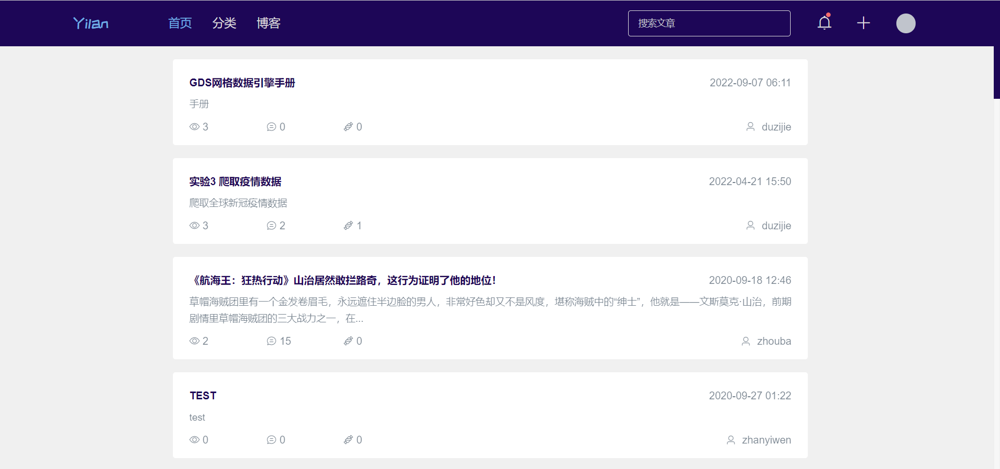

# 多用户易览博客系统

本系统是一个支持多用户注册的博客系统，具有写博客、浏览其他人博客、留言、点赞等功能。由Vue.js 2.0、Spring boot、Spring Security JWT、 Mybatis等技术构成。

## 用户端

### 用户登录页：

### 用户注册页：

### 用户登录成功后主页：

### 分类页：

### 文章浏览页：

### 简介：

### 个人文章列表：

### 关注用户：

### 私信交流：

### 个人文章管理：

### 文章编辑页面：

## 超级管理员后台管理

### 超级管理员登录页：

### 管理员管理：

### 文章过审：

### 公告管理：

需要源码者或其它合作者请联系微信号：**java_developer_1**
